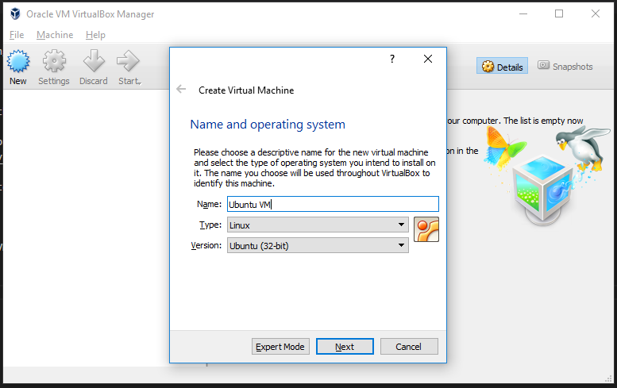
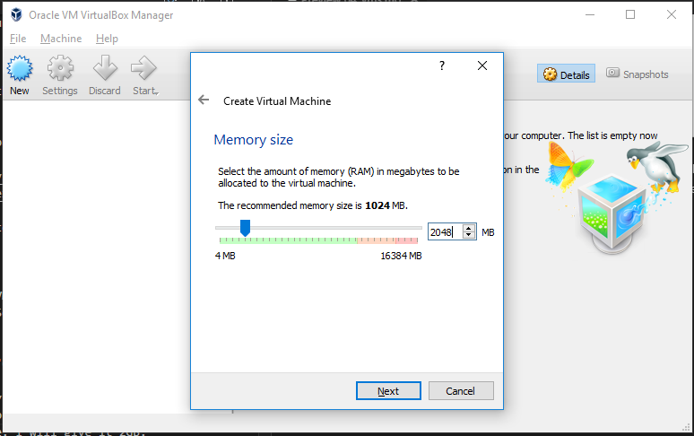

# Virtual Machines

At this step we will start playing with Virtual Machines and we will install a Ubuntu VM on our Windows desktop.

## Installing VirtualBox

IMPORTANT: Install specifically the version 5.1.30 of VirtualBox, not the latest.

This time we will not use Choco but go directly to the Windows VirtualBox download link [here](http://download.virtualbox.org/virtualbox/5.1.30/VirtualBox-5.1.30-118389-Win.exe).

Install VirtualBox at your computer.

## Installing Linux

Run VirtualBox and create a new VM. Choose the name you prefer. I named it "Ubuntu VM". Set it to Type Linux and Version Ubuntu (64 bit).

Depending on the amount of memory you have available you can give the VM 1, 2 or 4GB. Don't worry too much about it since you can adjust the memory anytime. I will give it 2GB.

Create a virtual disk. I will leave it with the defautl 10GB and default hard disk file type.

Now download the Ubuntu disk image to install in your new machine. Go to http://releases.ubuntu.com/16.04.3/ubuntu-16.04.3-desktop-amd64.iso and download the Ubunut Desktop ISO. Note that you can choose any Windows or Linux OS to install at your VM and you can have as many VMs as you like.

Once your download is completed, you can add the Ubuntu ISO to the virtual CD drive of your VM. Just start your VM and VirtualBox will ask you for the ISO.

Go through the installation process and play a bit with Ubuntu.
